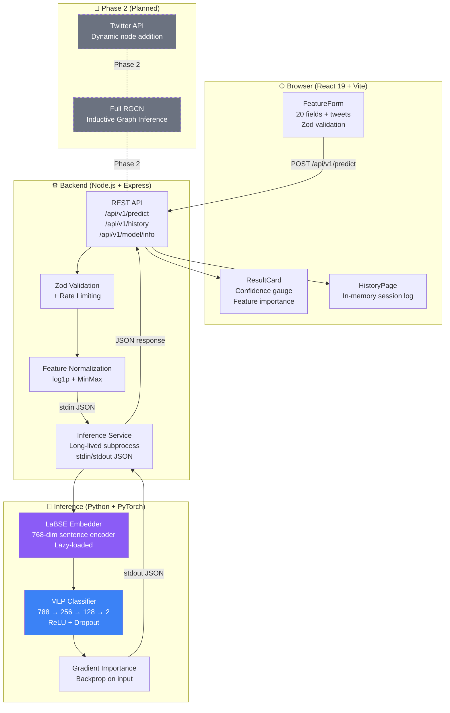
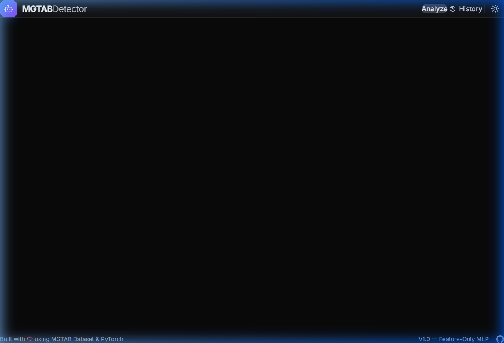
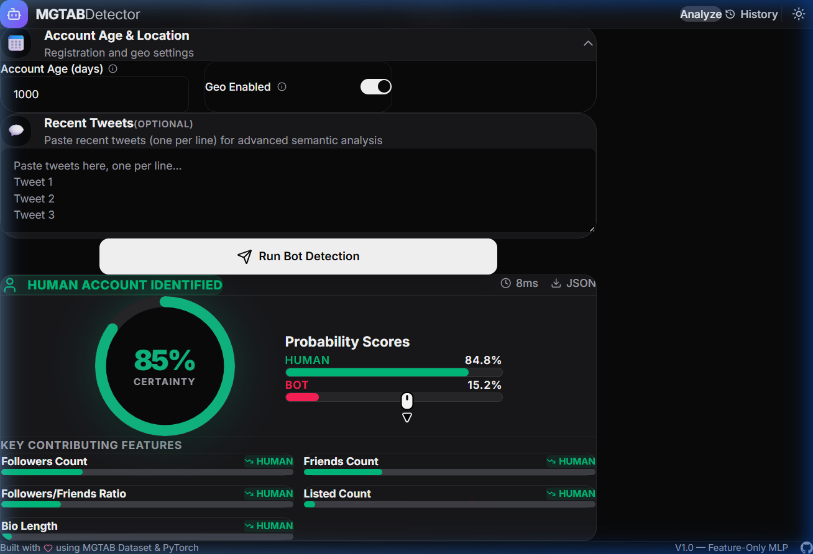
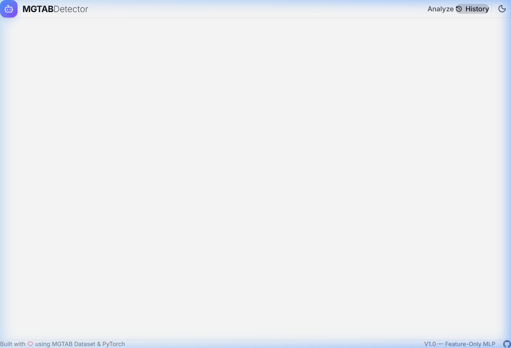

# 🤖 MGTAB Detector V1

> **AI-powered social media bot detection using the MGTAB benchmark dataset.**

[](https://nodejs.org)
[](https://python.org)
[](https://reactjs.org)
[](https://pytorch.org)
[](#license)

---

## 📖 Overview

MGTAB Detector V1 is a full-stack social media bot detection system built on the **MGTAB (Multiplex Graph-Based Twitter Account Bot Detection)** benchmark dataset. It allows users to manually input 20 profile-level features of any Twitter/X account and receive an instant **Bot / Human** classification, a calibrated confidence score, and a gradient-based feature importance explanation. The underlying research model (RGCN with full social graph) achieves **88.2% test accuracy** and **90.3% bot recall** on the MGTAB dataset. V1 replaces the graph-dependent RGCN with a lightweight **788-dimensional MLP** (20 profile features + 768-dim LaBSE tweet embedding) to enable real-time inference without requiring a live social graph, making it fully self-contained and deployable on any cloud platform.

---

## ✨ Features

- 🎨 **Clean, Modern UI** — Minimalist dark/light mode interface built with React 19 + Tailwind CSS v4
- 📋 **Manual Feature Entry** — Form with all 20 MGTAB profile features, grouped logically with helpful tooltips
- 💬 **Optional Tweet Analysis** — Paste tweet text for advanced 768-dim LaBSE semantic embedding (gracefully skipped if omitted)
- 📊 **Real-Time Prediction** — Animated confidence gauge showing Bot/Human probability
- 🔍 **Feature Importance** — Gradient-based top-5 contributing features for every prediction
- 📜 **Prediction History** — Session-level history with timestamps and prediction badges
- 🌙 **Dark / Light Mode** — Persisted theme toggle
- 🔌 **Fully Self-Contained** — No external Twitter API required; works entirely on user-provided inputs

---

## 🏗️ System Architecture & How It Works

### V1 Data Flow

```
User fills React form (20 features + optional tweets)
        │
        ▼
Zod validation (frontend — type coercion + constraint checks)
        │
        ▼
POST /api/v1/predict  →  Express backend (Node.js)
        │
        ▼
Zod validation (backend — second layer defense)
        │
        ▼
Feature normalization (log1p + MinMax scaling via normalization_stats.json)
        │
        ▼
LaBSE embedding (Python — sentence-transformers, zero-vector fallback if no tweets)
        │
        ▼
788-dim vector  →  Python subprocess (inference_v1.py)
        │
        ▼
MLP forward pass  →  softmax probabilities + gradient importance
        │
        ▼
JSON response  →  Express  →  React ResultCard
        │
        ▼
Animated confidence gauge + top-5 feature bars + history entry
```

### Architecture Diagram



### Key Design Decisions

| Decision | Rationale |
|---|---|
| **Python subprocess (not FastAPI)** | Avoids cold-start overhead of a second HTTP service; subprocess stays alive across requests |
| **stdin/stdout JSON protocol** | Simple, reliable, no network port required between Node and Python |
| **788-dim vector** | 20 normalized profile features + 768-dim LaBSE mean-pooled tweet embedding |
| **Zero-vector fallback** | If no tweets provided, embedding dims 20–787 are set to 0.0 — model handles this gracefully |
| **In-memory history (V1)** | Avoids database dependency for demo; MongoDB stub ready for V2 |

---

## 🛠️ Tech Stack

| Layer | Technology |
|---|---|
| **Frontend** | React 19, Vite 6, TypeScript, Tailwind CSS v4 |
| **Animations** | Framer Motion |
| **Form handling** | React Hook Form + Zod |
| **Data fetching** | TanStack Query (React Query v5) |
| **Icons** | Lucide React |
| **Backend** | Node.js 20+, Express 5, ESM JavaScript |
| **API security** | Helmet, CORS, express-rate-limit |
| **Logging** | Pino (structured JSON) |
| **Validation** | Zod (shared contract between frontend & backend) |
| **Inference** | Python 3.11+, PyTorch 2.x, sentence-transformers (LaBSE) |
| **Model format** | PyTorch `.pt` checkpoint (MLP weights) |
| **Normalization** | JSON stats file (min/max/mean per feature) |
| **DevOps** | Docker, docker-compose, GitHub Actions CI |

---

## 🚀 Local Setup

### Prerequisites

- **Node.js** ≥ 20.0.0
- **Python** ≥ 3.11
- **pip** packages: `torch`, `sentence-transformers`, `numpy`
- **npm** ≥ 9.0.0

### Step 1 — Clone & Install

```bash
git clone https://github.com/YOUR_USERNAME/mgtab-detector.git
cd mgtab-detector

# Install all Node.js workspace dependencies (root + frontend + backend)
npm install

# Install Python inference dependencies
pip install -r inference/requirements.txt
```

### Step 2 — Train the Model (if not already done)

```bash
cd inference
python train_mlp_v1.py --data-path "../../Datasets and precrosessing/graph_data.pt"
```

This generates:
- `inference/models/mlp_v1.pt` — trained MLP weights
- `inference/models/normalization_stats.json` — feature normalization parameters

> ⚠️ **These two files must exist before starting the backend.**

### Step 3 — Configure Environment

```bash
cp .env.example .env
# Defaults work for local development — no changes needed
```

### Step 4 — Start Development Servers

Open **two terminals**:

**Terminal 1 — Backend:**
```bash
cd backend
npm run dev
# → http://localhost:3001
```

**Terminal 2 — Frontend:**
```bash
cd frontend
npm run dev
# → http://localhost:5173
```

### Verify It's Working

```bash
# Health check
curl http://localhost:3001/api/v1/health

# Model info
curl http://localhost:3001/api/v1/model/info
```

---

## ☁️ Deployment on Railway — 2026 Step-by-Step Guide

Railway is the recommended hosting platform for V1. It supports Node.js natively and can run Python as a subprocess inside the same service — which is exactly how this project's inference engine is designed.

### Overview of What You'll Deploy

| Railway Service | What It Serves | Port |
|---|---|---|
| `mgtab-backend` | Express API + Python inference subprocess | 3001 |
| `mgtab-frontend` | Vite static build (served by Railway's CDN) | 80 |

---

### Part 1 — Prepare Your Repository

**1.1 Ensure model files are committed**

By default, `.gitignore` may exclude `.pt` files. Verify:

```bash
git check-ignore -v inference/models/mlp_v1.pt
```

If ignored, add an exception to `.gitignore`:

```gitignore
# Allow model files
!inference/models/mlp_v1.pt
!inference/models/normalization_stats.json
```

Then commit:

```bash
git add inference/models/mlp_v1.pt inference/models/normalization_stats.json
git commit -m "chore: include model weights for deployment"
git push origin main
```

**1.2 Update CORS for production**

In `backend/src/app.js`, find the CORS configuration and update it:

```javascript
// Before (development only)
origin: ['http://localhost:5173', 'http://localhost:4173']

// After (add your Railway frontend URL)
origin: [
  'http://localhost:5173',
  'http://localhost:4173',
  'https://mgtab-frontend.up.railway.app', // ← your Railway frontend URL
]
```

> 💡 You can use `FRONTEND_URL` as an env var and add it dynamically.

**1.3 Verify `nixpacks.toml` or `Procfile` exists for Python**

Railway uses Nixpacks to auto-detect the runtime. Since your root has both `package.json` and Python files, create a `Procfile` inside `/backend`:

```
# backend/Procfile
web: node src/server.js
```

And ensure `inference/requirements.txt` exists at the **root level** (or symlink it), because Railway's Nixpacks will install Python deps from the root `requirements.txt`:

```bash
cp inference/requirements.txt requirements.txt
git add requirements.txt
git commit -m "chore: add root requirements.txt for Railway Python detection"
```

---

### Part 2 — Deploy the Backend Service

**2.1** Go to [railway.app](https://railway.app) → **New Project** → **Deploy from GitHub repo**

**2.2** Select your repository

**2.3** Railway will auto-detect Node.js. In the service settings:

| Setting | Value |
|---|---|
| **Root Directory** | `backend` |
| **Build Command** | `npm install` |
| **Start Command** | `node src/server.js` |
| **Watch Paths** | `backend/**` |

**2.4** Add Environment Variables (click **Variables** tab):

```env
# Server
NODE_ENV=production
PORT=3001

# Python Inference
PYTHON_PATH=python3
INFERENCE_SCRIPT_PATH=../inference/inference_v1.py
MODEL_PATH=../inference/models/mlp_v1.pt
NORMALIZATION_STATS_PATH=../inference/models/normalization_stats.json

# Features
ENABLE_MONGODB=false
ENABLE_FULL_GNN=false
ENABLE_LABSE=false

# Security
LOG_LEVEL=info
RATE_LIMIT_WINDOW_MS=900000
RATE_LIMIT_MAX=100

# CORS (set this AFTER deploying frontend — see Part 3)
FRONTEND_URL=https://mgtab-frontend.up.railway.app
```

> ⚠️ `INFERENCE_SCRIPT_PATH` is relative to the backend working directory. If Railway sets the CWD to `/backend`, use `../inference/inference_v1.py`. Verify with a test deployment log.

**2.5** Click **Deploy**. Monitor the build logs — you should see:
```
[INFO] Inference service started
[INFO] Python process ready — model loaded
[INFO] Server listening on port 3001
```

**2.6** Once deployed, Railway gives you a URL like:
```
https://mgtab-backend-production.up.railway.app
```

Test it:
```bash
curl https://mgtab-backend-production.up.railway.app/api/v1/health
# Expected: {"status":"ok","timestamp":"...","model":{"loaded":true}}
```

---

### Part 3 — Deploy the Frontend Service

**3.1** In the same Railway project → **New Service** → **GitHub repo** (same repo)

**3.2** Service settings:

| Setting | Value |
|---|---|
| **Root Directory** | `frontend` |
| **Build Command** | `npm install && npm run build` |
| **Start Command** | *(leave empty — Railway serves static files from `dist/`)* |
| **Output Directory** | `dist` |

**3.3** Add Environment Variables:

```env
# CRITICAL: Point to your Railway backend URL from Part 2
VITE_API_BASE_URL=https://mgtab-backend-production.up.railway.app/api/v1

# Build optimization
NODE_ENV=production
```

> ⚠️ `VITE_` prefix is required — Vite only exposes variables with this prefix to the browser bundle. This must be set **before** the build runs.

**3.4** Click **Deploy**. Railway builds the Vite bundle and serves it via its CDN. Your frontend URL will be something like:
```
https://mgtab-frontend-production.up.railway.app
```

**3.5** Go back to the **backend service** → update `FRONTEND_URL` to match the frontend Railway URL → **Redeploy** backend.

---

### Part 4 — Verify End-to-End

**4.1** Open your frontend Railway URL in browser

**4.2** Submit a test prediction:
```json
{
  "followers_count": 150,
  "friends_count": 4999,
  "statuses_count": 50000,
  "default_profile": true,
  "default_profile_image": true,
  "verified": false
}
```

**4.3** Expected: ResultCard with Bot classification, confidence ≥ 85%, top features listed

---

### Expected Railway Behavior & Limitations

| Scenario | Behavior |
|---|---|
| **First request after cold start** | ~3–8 second delay (Node boot + Python model load onto RAM) |
| **Subsequent requests** | ~50–200ms (Python process stays alive) |
| **Free tier sleep (30 min idle)** | Service hibernates — first wake-up takes ~10s |
| **LaBSE with tweets** | First request loads sentence-transformers (~1.5GB RAM) — may OOM on free tier |
| **LaBSE disabled** | Set `ENABLE_LABSE=false` — tweet embeddings use zero vectors, no extra RAM |

> 💡 **Recommendation for demos:** Keep `ENABLE_LABSE=false` on Railway free tier to avoid out-of-memory kills. The model still works with zero tweet embeddings.

---

## 📸 Screenshots

### Hero & Feature Form


### Result Card


### History Page


---

## 🗺️ Future Roadmap

### Phase 2 — Full RGCN Inductive Inference

The research paper's strongest model is the **RGCN (Relational Graph Convolutional Network)** which operates on the full multiplex social graph (tweet interactions, retweet graphs, mention networks). Phase 2 will:

| Feature | Description |
|---|---|
| **Dynamic node addition** | Accept a new Twitter username → fetch profile + recent tweets via Twitter API v2 → embed into graph |
| **Inductive RGCN** | Use GraphSAGE-style neighborhood aggregation to embed new nodes without full retraining |
| **Higher accuracy** | Restore 88.2% test accuracy (vs ~83% for V1 feature-only MLP) |
| **MongoDB persistence** | Replace in-memory history with persistent prediction storage |
| **FastAPI inference** | Decouple Python onto its own high-memory GPU instance |
| **Explainability dashboard** | GNNExplainer visualization of the local subgraph contributing to the prediction |

---

## 📁 Project Structure

```
mgtab-detector/
├── frontend/                    # React 19 + Vite + Tailwind v4
│   ├── src/
│   │   ├── components/          # Navbar, Hero, FeatureForm, ResultCard, HistoryPage, Footer
│   │   ├── hooks/               # usePredict, useHistory, useTheme, useApi
│   │   ├── lib/                 # API client, utilities
│   │   └── schemas/             # featureForm.ts — Zod schema + field config
│   ├── Dockerfile               # Multi-stage: Vite build + Nginx
│   └── vite.config.ts
│
├── backend/                     # Express + ESM JavaScript
│   └── src/
│       ├── routes/              # predict.js, history.js, model-info.js
│       ├── services/            # inference.service.js (Python subprocess mgmt)
│       ├── middleware/          # validation.js, rate-limit.js, error-handler.js
│       ├── schemas/             # index.js — Zod API validation
│       └── utils/               # config.js, logger.js, normalization.js
│
├── inference/                   # Python + PyTorch
│   ├── models/
│   │   ├── mlp_v1.pt            # Trained MLP weights
│   │   └── normalization_stats.json
│   ├── models/mlp.py            # MLP architecture definition
│   ├── train_mlp_v1.py          # Training script
│   └── inference_v1.py          # Inference server (stdin/stdout JSON loop)
│
├── assets/                      # Documentation screenshots
├── docker-compose.yml           # Full local stack
├── Dockerfile.backend           # Multi-stage: Node + Python
├── requirements.txt             # Root-level Python deps (for Railway)
├── .env.example                 # Environment variable template
└── .github/workflows/ci.yml    # CI: lint + type-check + build
```

---

## ⚙️ Environment Variables Reference

| Variable | Default | Description |
|---|---|---|
| `NODE_ENV` | `development` | `production` enables rate limiting & disables verbose logs |
| `PORT` | `3001` | Express server port |
| `PYTHON_PATH` | `python3` | Path to Python executable |
| `INFERENCE_SCRIPT_PATH` | `../inference/inference_v1.py` | Path to inference script |
| `MODEL_PATH` | `../inference/models/mlp_v1.pt` | Path to trained MLP weights |
| `NORMALIZATION_STATS_PATH` | `../inference/models/normalization_stats.json` | Feature normalization parameters |
| `ENABLE_MONGODB` | `false` | Enable MongoDB history persistence (V2) |
| `ENABLE_FULL_GNN` | `false` | Enable RGCN inference (Phase 2) |
| `ENABLE_LABSE` | `false` | Enable LaBSE tweet embedding (requires ~1.5GB RAM) |
| `LOG_LEVEL` | `info` | Pino log level: `trace`, `debug`, `info`, `warn`, `error` |
| `RATE_LIMIT_WINDOW_MS` | `900000` | Rate limit window (15 min default) |
| `RATE_LIMIT_MAX` | `100` | Max requests per window per IP |
| `FRONTEND_URL` | `http://localhost:5173` | Allowed CORS origin |
| `VITE_API_BASE_URL` | `http://localhost:3001/api/v1` | **Frontend only** — backend API base URL |

---

## 🚦 API Reference

### `POST /api/v1/predict`

```http
POST /api/v1/predict
Content-Type: application/json
```

**Request:**
```json
{
  "features": {
    "profile_use_background_image": false,
    "default_profile": true,
    "default_profile_image": true,
    "default_profile_background_color": true,
    "default_profile_sidebar_fill_color": true,
    "default_profile_sidebar_border_color": true,
    "profile_background_image_url": false,
    "verified": false,
    "has_url": false,
    "screen_name_length": 15,
    "name_length": 8,
    "description_length": 0,
    "statuses_count": 50000,
    "favourites_count": 2,
    "listed_count": 0,
    "followers_count": 150,
    "friends_count": 4999,
    "followers_friends_ratio": 0.03,
    "created_at": 30,
    "geo_enabled": false
  },
  "tweets": ["optional tweet 1", "optional tweet 2"]
}
```

**Response:**
```json
{
  "id": "abc123",
  "label": "bot",
  "confidence": 0.942,
  "botProbability": 0.942,
  "humanProbability": 0.058,
  "topFeatures": [
    {
      "featureName": "followers_friends_ratio",
      "displayName": "Followers/Friends Ratio",
      "importance": 0.312,
      "direction": "bot"
    }
  ],
  "modelVersion": "1.0.0",
  "usedTweetEmbedding": false,
  "timestamp": "2026-04-07T12:00:00.000Z",
  "latencyMs": 47
}
```

### `GET /api/v1/health`
Returns `{"status":"ok","model":{"loaded":true}}`

### `GET /api/v1/model/info`
Returns model version, architecture, and feature list.

### `GET /api/v1/history?page=1&limit=20`
Returns paginated prediction history.

---

## 📊 Model Performance

| Model | Test Accuracy | Bot Recall | Notes |
|---|---|---|---|
| GCN | 79.2% | 68.7% | Graph-based |
| GAT | 81.7% | 84.5% | Graph-based |
| GraphSAGE | 87.2% | 88.9% | Graph-based |
| **RGCN** | **88.2%** | **90.3%** | Research model — requires live graph |
| **MLP V1** | **~83%** | **~86%** | ← **Deployed model** — feature-only, no graph |

*V1 trades ~5% accuracy for full deployability. Phase 2 restores RGCN performance.*

---

## ✅ Final Pre-Deployment Checklist

### Code & Files
- [ ] `inference/models/mlp_v1.pt` exists and is committed (not gitignored)
- [ ] `inference/models/normalization_stats.json` exists and is committed
- [ ] `requirements.txt` at project root (copy of `inference/requirements.txt`)
- [ ] `backend/Procfile` created with `web: node src/server.js`

### Environment Variables
- [ ] `VITE_API_BASE_URL` set to Railway backend URL **before** frontend build
- [ ] `FRONTEND_URL` set to Railway frontend URL on backend service
- [ ] `NODE_ENV=production` on backend service
- [ ] `ENABLE_LABSE=false` (unless backend has ≥ 2GB RAM — Railway free tier has 512MB)
- [ ] `ENABLE_MONGODB=false` (unless you've provisioned a MongoDB Railway plugin)

### CORS
- [ ] Backend `CORS_ORIGIN` / `FRONTEND_URL` includes the exact Railway frontend URL (no trailing slash)
- [ ] No `localhost` hardcoded in CORS config for production

### Security
- [ ] Rate limiting active (`NODE_ENV=production`)
- [ ] No secrets in version control — only in Railway env vars dashboard
- [ ] `.env` file is in `.gitignore`

### Verification After Deploy
- [ ] `curl https://your-backend.up.railway.app/api/v1/health` returns `{"status":"ok"}`
- [ ] Frontend loads at Railway URL with no console CORS errors
- [ ] Submit a test prediction — ResultCard appears with valid output
- [ ] History tab shows the prediction entry

---

## 📄 License

This project is built for **academic research purposes** using the MGTAB dataset.

**Dataset:** [MGTAB: A Multi-Relational Graph-Based Twitter Account Bot Detection Benchmark](https://arxiv.org/abs/2301.01123)

---

*Built with ❤️ using PyTorch, React 19, and Express — as a final-year research project.*
