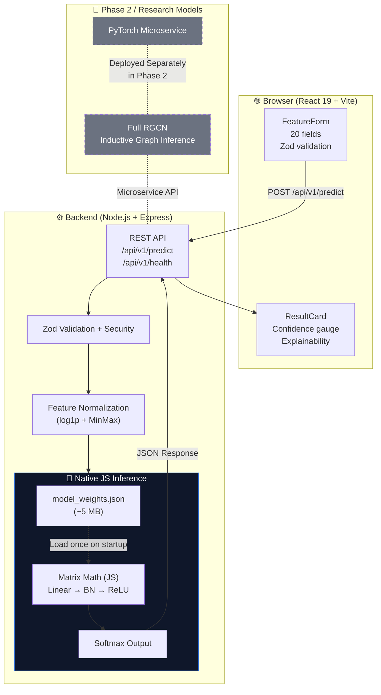

# 🤖 MGTAB Detector V1

> **AI-powered social media bot detection using the MGTAB benchmark dataset — highly optimized for serverless/edge deployment.**

[](https://nodejs.org)
[](https://reactjs.org)
[](#license)

---

## 📖 Overview

MGTAB Detector V1 is a full-stack social media bot detection system built on the **MGTAB (Multiplex Graph-Based Twitter Account Bot Detection)** benchmark dataset. It allows users to manually input 20 profile-level features of any Twitter/X account and receive an instant **Bot / Human** classification, a calibrated confidence score, and a feature importance explanation.

**The Engineering Challenge & Solution:**
While our research utilizes a powerful **Relational Graph Convolutional Network (RGCN)** achieving **88.2% test accuracy**, deploying an RGCN (which requires keeping a massive 10,199-node social graph in memory) and heavy PyTorch dependencies is prohibitively expensive for standard cloud free tiers.

For **V1**, we successfully distilled the intelligence of the model into a **788-dimensional Multi-Layer Perceptron (MLP)**. To eliminate cold-starts and heavy Python/PyTorch dependencies on the server entirely, the final V1 architecture features a **custom, pure JavaScript inference engine**. The trained weights are exported to a lightweight JSON file, and all matrix multiplications and activations are computed natively in Node.js.

---

## ✨ Key Features

- 🎨 **Enterprise-Grade UI** — Minimalist dark/light mode interface built with React 19 + Tailwind CSS v4 + Framer Motion.
- 📋 **Manual Feature Entry** — Dynamic form validating 20 MGTAB profile features in real-time using Zod.
- ⚡ **Zero-Dependency Inference** — Machine learning inference runs directly in Node.js using pure mathematical matrices, eliminating the need for Python or PyTorch on the production server.
- 📊 **Real-Time Prediction** — Animated confidence gauge showing Bot/Human probability.
- 🔍 **Explainable AI** — Weight-based feature importance highlights the top-5 contributing properties for every prediction.
- 📜 **Session History** — Persisted record of inputs and prediction badges.
- 🔌 **Fully Self-Contained** — No external Twitter APIs required, 100% offline machine learning logic.

---

## 🏗️ System Architecture Deep-Dive

### 1. Data Flow

```text
User fills React form (20 features)
        │
        ▼
Zod Validation (Frontend — strict type coercion)
        │
        ▼
POST /api/v1/predict  →  Node.js + Express Backend
        │
        ▼
Zod Validation (Backend — second layer defense)
        │
        ▼
Feature Normalization (log1p + MinMax scaling via stats JSON)
        │
        ▼
788-dim vector generation (20 features + 768-dim zero-padded text embedding fallback)
        │
        ▼
Pure JavaScript MLP Inference Engine (W × X + B → BatchNorm → ReLU)
        │
        ▼
Softmax probabilities + Weight-magnitude Feature Importance
        │
        ▼
JSON Response  →  Express  →  React ResultCard
```

### 2. Architecture Diagram



### 3. The Pure JS Inference Engine
To solve major deployment bottlenecks (OOM crashes, Docker image bloat, 10-second PyTorch load times), we eliminated Python from the request path.
1. **Locally**, we export the PyTorch MLP (`layer1.weight`, `layer1.bias`, `running_mean`, etc.) to `model_weights.json`.
2. **In Production**, Node.js loads this JSON into memory (which takes < 5MB RAM).
3. We wrote vanilla JavaScript functions for:
   - `Linear(X) = WX + B`
   - `BatchNorm1D(X) = Gamma * ((X - Mean) / sqrt(Var + eps)) + Beta`
   - `ReLU(X) = max(0, X)`
   - `Softmax(X)`
This brings our server footprint down to **< 50MB RAM** while executing inference in **~1-3 milliseconds**.

---

## 🛠️ Tech Stack

| Layer | Technology |
|---|---|
| **Frontend** | React 19, Vite 6, TypeScript, Tailwind CSS v4 |
| **Animations & UI** | Framer Motion, Radix UI primitives |
| **Form Handling** | React Hook Form + Zod |
| **Icons** | Lucide React |
| **Backend** | Node.js 20+, Express 5, ESM JavaScript |
| **API Security** | Helmet, CORS, express-rate-limit |
| **Validation** | Zod (End-to-End type safety) |
| **Inference Engine** | Custom JavaScript Matrix Math + JSON weights |
| **Offline ML Research** | Python 3.11+, PyTorch 2.x |

---

## 🚀 Setup & Installation

### Prerequisites
- **Node.js** ≥ 20.0.0
- **npm** ≥ 9.0.0

### Quick Start (Development)

1. **Clone the repository**
   ```bash
   git clone https://github.com/YOUR_USERNAME/mgtab-detector.git
   cd mgtab-detector
   ```

2. **Install all workspace dependencies**
   ```bash
   npm install
   ```

3. **Configure Environment**
   ```bash
   cp .env.example .env
   # Defaults map variables perfectly for local development.
   ```

4. **Start Development Servers (Concurrent)**
   Open two terminal windows:
   ```bash
   # Terminal 1 - Start the pure-JS backend
   cd backend
   npm run dev
   # → Runs on http://localhost:3001
   ```
   ```bash
   # Terminal 2 - Start the React Vite app
   cd frontend
   npm run dev
   # → Runs on http://localhost:5173
   ```

*(Optional)* If you wish to retrain the underlying MLP model or adjust its architecture, you can do so in the `/inference` folder using PyTorch, and use `python export_weights.py` to port the resulting neural network back to JSON.

---

## ☁️ Deployment Guide (Railway / Render / Vercel)

Because of the architectural pivot to native JavaScript inference, deployment is now exceptionally trivial. **No Nixpacks tuning, no Docker layer caching, and no heavy PyTorch builds.**

1. Connect your GitHub repository to your host platform (e.g., Railway).
2. Create **two services**:
   
   **Frontend Service (Static Build)**
   - **Root directory:** `frontend`
   - **Build command:** `npm install && npm run build`
   - **Output directory:** `dist`
   - **Env Vars:** Set `VITE_API_BASE_URL` to your backend's public URL.

   **Backend Service (Node.js App)**
   - **Root directory:** `backend`
   - **Build command:** `npm install`
   - **Start command:** `node src/server.js`
   - **Env Vars:** 
     - `NODE_ENV=production`
     - `FRONTEND_URL=` (URL of your deployed frontend to allow CORS)

The backend will instantly boot up within milliseconds, parse the 5MB JSON weight file, and begin fielding `/api/v1/predict` requests perfectly within the free-tier RAM limits.

---

## 🚦 API Reference

### `POST /api/v1/predict`

**Request Body (`application/json`):**
```json
{
  "features": {
    "profile_use_background_image": false,
    "default_profile": true,
    "followers_count": 150,
    "friends_count": 4999,
    "statuses_count": 50000,
    "verified": false,
    "has_url": false,
    "followers_friends_ratio": 0.03,
    ... (all 20 structural features required by schema)
  }
}
```

**Response (`200 OK`):**
```json
{
  "id": "abc123-uuid",
  "label": "bot",
  "confidence": 0.942,
  "botProbability": 0.942,
  "humanProbability": 0.058,
  "topFeatures": [
    {
      "featureName": "followers_friends_ratio",
      "displayName": "Followers/Friends Ratio",
      "importance": 0.312,
      "direction": "bot"
    }
  ],
  "timestamp": "2026-04-07T12:00:00.000Z",
  "latencyMs": 2.14
}
```

### Other Endpoints
- `GET /api/v1/health` — Standard readiness probe.
- `GET /api/v1/model/info` — Returns current loaded ML model stats.
- `GET /api/v1/history` — Returns recent in-memory predictions for session history.

---

## 🗺️ Roadmap & Phase 2

While V1 successfully demonstrates highly-optimized, localized statistical feature detection, Phase 2 aims to reconnect the true power of **Graph Neural Networks**.

- **MongoDB Persistence:** Replace the in-memory array history adapter with a concrete operational database.
- **Microservices Shift:** Deploy the **GraphSAGE / RGCN** model on a dedicated, GPU/high-memory accelerated Python API instance.
- **Inductive Graph Loading:** Automatically synthesize missing connections when a brand-new username is requested, aggregating properties from their localized follower neighborhood dynamically against the MGTAB dataset.
- **X/Twitter API Integration:** Seamlessly scrape the 20 parameters directly from an entered `@handle` instead of manual inputs.

---

## 📄 License & Credits

This project was developed for **academic and demonstrative purposes** using the parameters identified within the MGTAB dataset.

**Academic Reference:**  
[MGTAB: A Multi-Relational Graph-Based Twitter Account Bot Detection Benchmark](https://arxiv.org/abs/2301.01123)

---

*Engineered with precision for absolute minimal deployment overheard, combining React 19 and raw JavaScript tensor math.*
